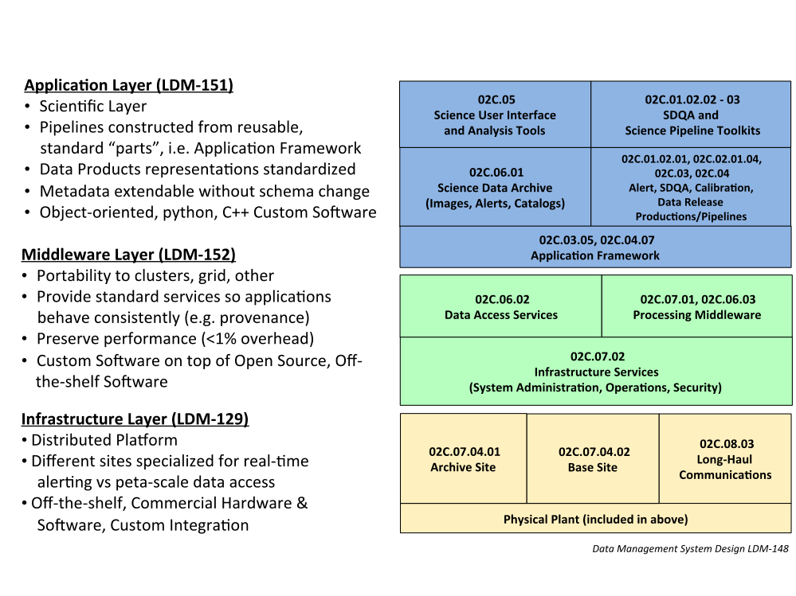
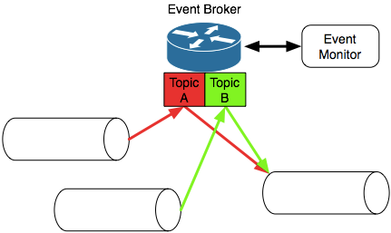

:tocdepth: 1

.. sectnum::

.. exec-summary:

Executive Summary
=================

The LSST middleware is designed to isolate scientific applications,
including the Alert Production, Data Release Production, Calibration
Products Production, and Level 3 processing, from details of the
underlying hardware and system software. It enables flexible reuse of
the same code in multiple environments ranging from offline laptops to
shared-memory multiprocessors to grid-accessed clusters, with a common
communication and logging model. It ensures that key scientific and
deployment parameters controlling execution can be easily modified
without changing code but also with full provenance to understand what
environment and parameters were used to produce any dataset. It provides
flexible, high-performance, low-overhead persistence and retrieval of
datasets with data repositories and formats selected by external
parameters rather than hard-coding. Middleware services enable
efficient, managed replication of data over both wide area networks and
local area networks.

.. intro:

Introduction
============

This document describes the baseline design of the LSST data access and
processing middleware, including the following elements of the Data
Management (DM) Construction Work Breakdown Structure (WBS):

-  :ref:`02C.06.02.01 Data Access Client Framework <dac-framework>`

-  :ref:`02C.06.03 Pipeline Execution Services <pipeline-execution-services>` including:

   -  :ref:`02C.06.03.01 Pipeline Construction Toolkit <pipeline-construction-toolkit>`

   -  :ref:`02C.06.03.02 Logging Services <logging>`

   -  :ref:`02C.06.03.03 Inter-Process Communication Services <ipms>`

   -  :ref:`02C.06.03.04 Checkpoint/Restart Services <checkpoint>`

-  :ref:`02C.07.01 Processing Control <processing-control>` including:

   -  :ref:`02C.07.01.01 Data Management Control System <dmcs>`

   -  :ref:`02C.07.01.02 Orchestration Manager <orchestration-manager>`

-  :ref:`02C.07.02.01 Event Services <event-services>`

The LSST database design, WBS elements 02C.06.02.02 and 02C.06.02.03,
may be found in the document entitled “Data Management Database Design”
(LDM-135). As to the remainder of WBS element 02C.07.02, WBS element
02C.07.02.02 is described in “LSST Cybersecurity Plan” (LSE-99).
02C.07.02.03 (visualization) and 02C.07.02.04 (system administration)
are primarily low-level, off-the-shelf tools and are not described
further here. 02C.07.02.06 (VO Interfaces) will use standard VO tools
and protocols.

.. _dms-arch:

   Data Management System Layers.

Common to all aspects of the middleware design is an emphasis on
flexibility through the use of abstract, pluggable interfaces controlled
by managed, user-modifiable parameters. In addition, the substantial
computational and bandwidth requirements of the LSST Data Management
System (DMS) force the designs to be conscious of performance,
scalability, and fault tolerance. In most cases, the middleware does not
require advances over the state of the art; instead, it requires
abstraction to allow for future technological change and aggregation of
tools to provide the necessary features.

.. _dac-framework:

02C.06.02.01 Data Access Client Framework
=========================================

This WBS element contains the framework by which applications retrieve
datasets from and persist datasets to file and database storage. This
framework provides high-performance access to local resources (within a
data access center, for example) and low-performance access to remote
resources. These resources may include images, non-image files, and
databases

.. _dac-framework-key-reqs:

Key Requirements
----------------

The framework must provide persistence and retrieval capabilities to
application code. Persistence is the mechanism by which application
objects are written to files in some format or a database or a
combination of both; retrieval is the mechanism by which data in files
or a database or a combination of both is made available to application
code in the form of an application object. Persistence and retrieval
must be low-overhead, allowing efficient use of available bandwidth. The
interface to the I/O layer must be usable by application developers. It
is required to be flexible, allowing changes in file formats or even
whether a given object is stored in a file or the database to be
selected at runtime in a controlled manner. Image data must be able to
be stored in standard FITS format, although the metadata for the image
may be in either FITS headers or database table entries.

.. _dac-framework-baseline:

Baseline Design
---------------

The framework is designed to provide access to datasets. A dataset is a
logical grouping of data that is persisted or retrieved as a unit,
typically corresponding to a single programming object or a collection
of objects. Dataset types are predefined. Datasets are identified by a
unique identifier. Datasets may be persisted into multiple formats.

The framework is made up of two main components: a “Butler” that
provides a high-level, general-purpose dataset and repository access
interface and a “Mapper” that provides astronomy-specific and even
camera-specific methods for naming, persisting, and retrieving datasets.
Both are implemented in Python.

The Butler (formerly known as a Persistence object) manages repositories
of datasets which can be in files or in a database. The files may be
anywhere within a global namespace provided by the Infrastructure's File
System Services, including on tape. Operations on datasets include get,
put, list, and remove. One additional operation checks to see if a
dataset exists. If it does, it reads it and checks it for equality with
an existing Python object. If it does not, it writes it, using locking
to ensure that only one copy is written. This operation is useful for
compressing the recording of shared provenance information from multiple
simultaneous tasks.

The Butler contains a pluggable set of storage managers (formerly known
as Formatter and Storage subclasses) that handle persistence to and
retrieval from storage types such as Python pickle files, task
configuration override files (Python scripts), FITS tables, and SQL
databases. Metadata and provenance information is extracted by the
storage managers.

The Butler is initialized with zero or more read-only input repositories
and a read/write output repository. When reading a dataset, the output
repository is searched first; the "chained" input repositories are
searched if the dataset is not found. When writing a dataset, the
dataset always goes to the output repository, never to the chained
inputs (unless the output is specified as being the same as an input).
The set of input repositories is recorded for provenance purposes.

The Mapper translates from a dataset type name and one or more
astronomically meaningful key/value dictionaries into a dataset location
and storage. The location might be a pathname or URL for a file; it
would include an SQL query for a database.

The Mapper provides flexibility at many levels. First, it allows the
provided key/value dictionaries to be expanded using rules or database
lookups. This can be used to map from a visit identifier to an exposure
length, for example, or from a CCD name to an equivalent number. This
facility is used to implement the "rendezvous" of raw data with its
corresponding calibration data. Second, it allows the key/value pairs to
be turned into a location string using a dataset type-dependent method.
Typically, this will be performed by substitution into a dataset
type-specific template. Third, the Mapper allows camera-specific and
repository-specific overrides and extensions to the list of rules and
templates, enabling per-camera and dynamic dataset type creation.

.. _dac-framework-alts:

Alternatives Considered
-----------------------

Use of a full-fledged object-relational mapping system for output to a
database was considered but determined to be too heavyweight and
intrusive. Persistence from C++ was tried and found to be complex and
unnecessary; Python persistence suffices since all control is in Python.

.. _dac-framework-prototype:

Prototype Implementation
------------------------

A C++ implementation of the original design was created for Data
Challenge 2 (DC2) that allows input and output of images and exposures,
sources and objects, and PSFs. Datasets were identified by URLs. Storage
mechanisms included `FITS <http://fits.gsfc.nasa.gov/>`_ files,
`Boost::serialization
<http://www.boost.org/doc/libs/1_47_0/libs/serialization/doc/index.html>`_
streams (native and XML), and the `MySQL <http://www.mysql.com/>`_
database (via direct API calls or via an intermediate,
higher-performance, bulk-loaded tab-separated value file).  The camera
interface has not yet been prototyped.

This implementation was extended in DC3 to include a Python-based
version of the same design that uses the C++ implementation internally.
This new implementation is the basis of the new baseline design.
Experience in the last few Data Challenges has demonstrated that this
framework is easier to use and more flexible than the C++ one. Since the
low-level I/O code remains in C++, the framework's performance remains
good. A Python-only Storage class has been added to allow persistence
via the Python "pickle" mechanism.

Further refinement of the implementation has produced classes that can
be written to and read from FITS tables. The Mapper class has been
extended to provide automatic management of dataset repositories.

.. _image-file-services:

02C.06.02.04 Image and File Services
====================================

Image and File Services manages a virtual read-only repository of files,
including image files. This is required because the size of the LSST
data products makes it infeasible to store them all; it is more
cost-effective to provide the CPU cycles needed to regenerate them on
demand.

.. _image-file-services-baseline:

Baseline Design
---------------

When a file is requested, a cache maintained by the service is checked.
If the file exists in the cache, it is returned. If the file does not
exist, configurable rules are consulted to remove one or more files to
make room for it in the cache, if necessary. (If no room is currently
available because all cached files are being used, the request is
blocked.) The file is then regenerated by invoking application pipeline
code based on provenance and metadata information stored in the
repository. The regenerated file is placed in the cache.

.. _image-file-services-prototype:

Prototype Implementation
------------------------

This service has not yet been prototyped.

.. _event-services:

02C.07.02.01 Event Services
===========================

The event service is used to communicate among components of the DM
System, including between pipelines in a production. A monitoring
component of the service can execute rules based on patterns of events,
enabling fault detection and recovery.

.. _event-services-key-reqs:

Key Requirements
----------------

The event service must reliably transfer events from source to multiple
destinations. There must be no central point of failure. The service
must be scalable to handle high volumes of messages, up to tens of
thousands per second. It must interface to languages including Python
and C++.

A monitoring component must be able to detect the absence of messages
within a given time window and the presence of messages (such as logged
exceptions) defined by a pattern.

.. _event-services-baseline:

Baseline Design
---------------

The service will be built as a wrapper over a reliable messaging system
such as `Apache ActiveMQ <http://activemq.apache.org>`_. Event
subclasses and standardized metadata will be defined in C++ and wrapped
using `SWIG <http://www.swig.org>`_ to make them accessible from Python.
Events will be published to a topic; multiple receivers may subscribe to
that topic to receive copies of the events.

The event monitor subscribes to topics that indicate faults or other
system status. It can match templates to events, including boolean
expressions and time expressions applied to event data and metadata.

.. _fig-event-broker:

.. _event-services-prototype:

Prototype Implementation
------------------------

An implementation of the event subsystem on Apache ActiveMQ was created
for DC2 and has evolved since then. Command, Log, Monitor, PipelineLog,
and Status event types have been defined. Event receivers include
pipeline components, orchestration components, the event monitor, and a
logger that inserts entries into a database. Tests have demonstrated the
ability to handle tens of thousands of events per second through the
event broker, although the code to store events in a database is not yet
up to that level of performance.

The event monitor has been prototyped in Java

.. _processing-control:

02C.07.01 Processing Control
============================

.. _orchestration-manager:

02C.07.01.02 Orchestration Manager
----------------------------------

The Orchestration Manager is responsible for deploying pipelines and
Policies onto nodes, ensuring that their input data is staged
appropriately, distributing dataset identifiers to be processed,
recording provenance, and actually starting pipeline execution.

.. _orchestration-manager-key-reqs:

Key Requirements
~~~~~~~~~~~~~~~~

The Orchestration Manager must be able to deploy pipelines and their
associated configuration Policies onto one or more nodes in a cluster.
Different pipelines may be deployed to different, although possibly
overlapping, subsets of nodes. All three pipeline execution models (see
:ref:`pipeline-framework`) must be supported. Sufficient provenance
information must be captured to ensure that datasets can be reproduced
from their inputs.

The Orchestration Manager at the Base Center works with the DM Control
System (DMCS, see :ref:`dmcs`) at that Center
to accept commands from the OCS to enter various system modes such as
Nightly Observing or Daytime Calibration. The DMCS invokes the
Orchestration Manager to configure and execute data transfer and Alert
Production pipelines accordingly. At the Archive Center, the
Orchestration Manager controls execution of the Data Release Production,
including managing data dependencies between pipelines.

Orchestration must detect failures, categorize them as permanent or
possibly-transient, and restart transiently-failed processing according
to the appropriate fault tolerance strategy.

.. _orchestration-manager-baseline:

Baseline Design
~~~~~~~~~~~~~~~

The design for the Orchestration Manager is a pluggable,
configuration-controlled framework. Plug-in modules are used to
configure and deploy pipelines on a variety of underlying process
management technologies (such as simple `ssh <http://openssh.com/>`_ or
batch systems), which is necessary during design and development when
hardware is typically borrowed rather than owned. For the operational
system, `HTCondor <http://research.cs.wisc.edu/htcondor/>`_ is the
selected process management technology. Additional modules capture
hardware, software, and configuration provenance, including information
about the execution nodes, the versions of all software packages, and
the values of all configuration parameters for both middleware and
applications.

The manager (or its underlying process management technology) monitors
the availability of datasets and can trigger the execution of pipelines
when their inputs become available. It can hand out datasets to nodes
based on the history of execution and the availability of locally-cached
datasets to minimize data movement.

Faults are detected by the pipeline harness and event monitor timeouts.
Orchestration then reprocesses transiently-failed datasets.

If technology advancement, performance, or community practice led us to
change the process management technology, e.g. to something like `Apache
Hadoop <http://hadoop.apache.org/>`_, the orchestration manager plugins
that handle task submission and data staging would need to be modified
to submit task graphs under YARN and to rely on HDFS, respectively, but
the underlying applications would not necessarily have to change.

.. _orchestration-manager-prototype:

Prototype Implementation
~~~~~~~~~~~~~~~~~~~~~~~~

A prototype implementation of the deployment framework was developed for
DC3a. It was extended to use Condor-G to manage deployed processes, and
data dependency features were added for DC3b. Provenance is recorded in
files and, to a limited extent, in a database. The file-based provenance
has been demonstrated to be sufficient to regenerate datasets.

HTCondor provides many of the capabilities required from the
Orchestration Manager and other middleware components such as data
distribution, fault tolerance, and checkpoint/resume. The current
prototype of the Orchestration Manager uses it to execute startup and
shutdown code, distribute datasets to pipelines, group those datasets to
ensure sufficient job length to amortize overheads, and automatically
restart failed jobs. The Summer 2013 Data Challenge [#f1]_ showed that
HTCondor could execute Tasks at scales of up to 10,000 cores without
bottlenecks. When starting pipelines on an empty cluster, as will be the
case for the Alert Production, the Orchestration Manager was able to
achieve Task submission rates of 8 per second with instantaneous rates
of 25 per second, leading us to believe that 200 jobs could be executed
within 10 seconds. Efficiency for the Data Release Production will be
adequate, as the idle time between execution of Tasks on a worker node
was found to be less than 2 seconds, small in comparison with Task
lengths on the order of minutes.

.. _dmcs:

02C.07.01.01 Data Management Control System
-------------------------------------------

The LSST Data Management System at each center will be monitored and
controlled by a Data Management Control System (DMCS). The DMCS
requirements and design are described more fully in “Automated Operation
of the LSST Data Management System”, Document LDM-230.

.. _dmcs-key-reqs:

Key Requirements
~~~~~~~~~~~~~~~~

The DMCS at each site has two primary roles: a system administration and
monitoring role and a production sequencing and control role.

In the system administration role, the DMCS is responsible for
initializing and running application-level diagnostics on all equipment,
including computing nodes, disk storage, tape storage, and networking,
ensuring that each component is available for production use. It
verifies (again, at the application level) connectivity with the other
sites including the Headquarters Site. It uses the System Administration
Services from the infrastructure to monitor the operation of all
hardware and integrates with the orchestration layer (see
:ref:`processing-control`) to monitor software execution. System status
and control functions will be available via a Web-enabled tool to the
Headquarters Site and remote locations.

In the production sequencing role, the DMCS has different
responsibilities at each site.

At the Base Center, the DMCS is responsible for interfacing with the OCS
(as defined in “Control System Interfaces between the Telescope & Data
Management”, Document LSE-75). It accepts commands from the OCS to enter
various modes, including observing, calibration, day, maintenance, and
shutdown. It then configures and invokes the orchestration layer to
archive data locally, transfer data to the Archive Center, and execute
the Alert Production there.

At the Archive Center, the DMCS sequences the productions, ensuring that
each pipeline component processes all required data in the appropriate
granularity and order, and performs resource management for the compute
cluster. Parts of the cluster may be dedicated to certain activities
while others operate in a shared mode. The major processing activities
under DMCS control, invoked using the orchestration layer, include the
Alert Production processing (on dedicated hardware), the Calibration
Products Production, and the Data Release Production

At each Data Access Center, the DMCS performs resource management for
the level 3 data products compute cluster. It can be used to sequence
Level 3 computations, in particular those that run on Data Release
Production intermediate datasets.

.. _dmcs-baseline:

Baseline Design
~~~~~~~~~~~~~~~

For system administration, the DMCS will consist of an off-the-shelf
cluster management system together with a custom pluggable software
framework for automating system administration tasks. A Web-based
control panel and an off-the-shelf monitoring system will also be
integrated. Plugins will include hardware-specific initialization and
configuration software and interfaces to software package deployment
tools. The characteristics and hardware and software configuration of
each computer will be maintained in a central database.

A separate script-based component will handle the application-level
sequencing. This will include mode transition scripts to interface with
the OCS, event-handling scripts that respond to OCS and camera events,
and scripts to generate lists of datasets, lists of tasks, and graphs of
data dependencies between tasks for the execution of the Data Release
Production pipelines. Execution of these scripts will be triggered by
OCS events, DM Events, or operator control.

.. _dmcs-prototype:

Prototype Implementation
~~~~~~~~~~~~~~~~~~~~~~~~

The DMCS has not yet been prototyped. Scripts have been written to
automate execution of Data Challenge productions that are similar in
scope to the Data Release Production. An off-the-shelf system-level
monitoring solution is in place for the DM development cluster.

.. _pipeline-execution-services:

Pipeline Execution Services
===========================

.. _pipeline-construction-toolkit:

02C.06.03.01 Pipeline Construction Toolkit
------------------------------------------

The Pipeline Construction Toolkit provides a framework for packaging
scientific algorithms into executable and reusable pipelines. It handles
configuration, argument parsing, and interfacing with the I/O and
inter-process communications mechanisms.

.. _pipeline-config-framework:

Configuration Framework
~~~~~~~~~~~~~~~~~~~~~~~

The configuration component of the Pipeline Framework is a mechanism to
specify parameters for applications and middleware in a consistent,
managed way. The use of this component facilitates runtime
reconfiguration of the entire system while still ensuring consistency
and the maintenance of traceable provenance.

.. _pipeline-config-framework-key-reqs:

Key Requirements
^^^^^^^^^^^^^^^^

Configurations must be able to contain parameters of various types,
including at least strings, booleans, integers, and floating-point
numbers. Ordered lists of each of these must also be supported. Each
parameter must have a name. A hierarchical organization of names is
required so that all parameters associated with a given component may be
named and accessed as a group.

There must be a facility to specify legal and required parameters and
their types and to use this information to ensure that invalid
parameters are detected before code attempts to use them. Default values
for parameters must be able to be specified; it must also be possible to
override those default values, potentially multiple times (with the last
override controlling).

Configurations and their parameters must be stored in a user-modifiable
form. It is preferable for this form to be textual so that it is
human-readable and modifiable using an ordinary text editor.

It must be possible to save sufficient information about a configuration
to obtain the value of any of its parameters as seen by the application
code.

.. _pipeline-config-framework-baseline:

Baseline Design
^^^^^^^^^^^^^^^

The initial design based on a custom text file format has been refined
based on experimentation during the design and development phase.

Configurations are instances of a Python class. The class definition
specifies the legal parameter names, their types, default values if any,
minimum and maximum lengths for list values, and whether a parameter is
required. It also mandates that a documentation string be provided for
each parameter. Use of Python for defining configurations enables
inheritance, the use of package imports to easily refer to
configurations from other components, complex parameter validation, and
the ability to define powerful new parameter types. Default values in
configuration instances can be overridden by human-readable text files
containing normal Python code, simplifying the specification of multiple
similar parameters. Overrides can also be set using command line
parameters. The Python base class maintains complete history information
for every parameter, including its default and all overrides. The state
of a configuration as used by the application code can be written out
and optionally ingested into a database for provenance purposes .A
mechanism is provided to automatically translate between the Python
configuration instance and a control object for C++ code.

.. _pipeline-config-framework-prototype:

Prototype Implementation
^^^^^^^^^^^^^^^^^^^^^^^^

An implementation of the Python-based design has been used since
December 2011. It contains features such as selection of an algorithm by
name from a registry, automatically pulling in the algorithm’s
configuration. Tools are provided to print out the history of any
parameter.

.. _pipeline-framework:

Pipeline Framework
~~~~~~~~~~~~~~~~~~

A pipeline is a very common representation of astronomical processing.
Datasets are processed by a series of components in turn. Each component
applies an algorithm to one or more input datasets, producing one or
more outputs that are handed to the next component. More generally,
pipelines may be hierarchical, with a pipeline reused as a component in
another pipeline. Branching and looping control flows may also be
desirable. The pipeline framework provides the ability to create these
pipelines.

.. _pipeline-framework-key-reqs:

Key Requirements
^^^^^^^^^^^^^^^^

The pipeline framework must allow components to be specified in Python.
It must handle the transfer of datasets from component to component. To
ensure adequate performance for the Alert Production, such data transfer
must be possible in memory, not solely through disk files. Pipeline
components must be able to report errors and thereby prevent the
execution of downstream components.

The pipeline harness must support execution in three modes:

-  **Single task (serial mode).** One pipeline instance executes on one
   dataset. This mode is useful for development, testing, and debugging.

-  **Single task (parallel mode).** Multiple linked pipeline instances
   execute on multiple datasets belonging to a single task while
   communicating amongst themselves and synchronizing when appropriate.
   This mode is required for real-time alert processing.

-  **Multiple tasks (batch mode).** Multiple pipeline instances execute
   on one dataset each. Instances are independent of each other except
   that an instance may not be executed until all of its inputs are
   available. Instances may be executing different code to perform
   different tasks. This mode is required for some types of Data Release
   processing.

.. _pipeline-framework-baseline:

Baseline Design
^^^^^^^^^^^^^^^

The pipeline harness is comprised of Task objects. Tasks are simply
Python scripts with a common base class. Using Python enables Tasks to
support complex control flows without developing a new control flow
language. Tasks may call sub-Tasks as part of their execution. Errors
are reported through standard Python exception subclasses.

The Task base class provides configuration facilities using the
configuration framework. The Task configuration can include selection of
sub-Tasks to be executed, allowing the pipeline to be reconfigured at
runtime. Each Task has a method that allows discovery of its input and
output requirements. The Task framework also allows Tasks to save
metadata related to their processing, such as performance or data
quality information.

Certain Tasks are intended for direct use by productions or science
users. These “Command Line Tasks” have additional features built into
their base class: argument handling, configuration overrides, and
provenance capture. The argument handling functionality extends the
Python argument parser, providing a consistent experience to the user
while allowing Command Line Tasks to add needed arguments. Among the
supported arguments are options to allow configuration parameters to be
overridden by files or command line settings. Command Line Tasks by
default persist their configuration parameters, input data
specifications (which in turn can be followed back to instrument
configuration and conditions) and processing metadata for provenance
purposes; they also can be directed to capture their runtime
environment, including the versions of software packages in use and
machine information, or they can record a key tied to such environmental
information that is provided by external middleware.

Single Task (parallel mode) execution is supported by the `Inter-Process
Communication Services <ipms>`, which arrange to execute a
Task's algorithm in parallel.

This design is a refinement of the original pipeline framework design,
which described Pipelines composed of Stages communicating via a
Clipboard. Tasks take the place of Stages; Command Line Tasks replace
Pipelines; and the Clipboard is replaced by in-memory Python variables.

.. _pipeline-framework-prototype:

Prototype Implementations
^^^^^^^^^^^^^^^^^^^^^^^^^

An initial implementation of the framework was developed in C++ and
Python. It provided the ability to build pipelines by wrapping low-level
algorithms with Python Stages communicating using in-memory C++
Clipboard objects. While this implementation had low overhead, it proved
to be overly complex to use. It was difficult to debug pipelines since
they had to be executed within the framework (not simply from the
command line) and they mixed languages. Sophisticated branching and
looping control flows would have required significant development.

A second implementation has been developed in pure Python and used for
several Data Challenges. This implementation is currently limited to the
single-task serial and multiple-task batch modes of but it will be
extended to use thread-based or MPI-based communication in the future as
the `Inter-Process Communication Services <ipms>` are developed. This
implementation is the basis for the refined baseline design. It solves
the debugging issue by being able to be run under the Python debugger.
Task startup overhead is greater in this implementation, but batching
together processing of several datasets in a single Task overcomes this,
as demonstrated in the latest Data Challenges [#f2]_.

.. _logging:

02C.06.03.02 Logging Services
-----------------------------

The logging service is used by application and middleware code to record
status and debugging information.

.. _logging-key-reqs:

Key Requirements
~~~~~~~~~~~~~~~~

Log messages must be associated with component names organized
hierarchically. Logging levels controlling which messages are produced
must be configurable on a per-component level. There must be a way for
messages that are not produced to not add overhead. Logs must be able to
be written to local disk files as well as sent via the event subsystem.
Metadata about a component's context, such as a description of the CCD
being processed, must be able to be attached to a log message.

.. _logging-baseline:

Baseline Design
~~~~~~~~~~~~~~~

Log objects are created in a parent/child hierarchy and associated with
dotted-path names; each such Log and name has an importance threshold
associated with it. Methods on the Log object are used to record log
messages. One such method uses the C++ varargs functionality to avoid
formatting the message until it has been determined if the importance
meets the threshold. Log messages are contained within LogRecords that
have additional key/value contextual metadata.

Multiple LogDestination streams can be created and attached to Logs (and
inherited in child Logs). Each such stream has its own importance
threshold. LogRecords may also be formatted in different ways depending
on the LogDestination. LogRecords may also be incorporated into Events
(see :ref:`event-services`) and transmitted on a topic.

Two sets of wrappers around the basic Log objects simplify logging
start/stop timing messages and allow debug messages to be compiled out.

.. _logging-prototype:

Prototype Implementation
~~~~~~~~~~~~~~~~~~~~~~~~

A prototype implementation was created in C++ for DC2; the debugging and
logging components of that implementation were merged for DC3a. The C++
interface is wrapped by SWIG into Python.

A proof-of-concept implementation of much of the Logging Subsystem interface on
top of Apache `log4cxx <http://logging.apache.org/log4cxx/index.html>`_
demonstrated that it is possible to use off-the-shelf tools to implement the
design. An adapter would have to be written to enable log messages to be sent
via the Event subsystem.

.. _ipms:

02C.06.03.03 Inter-Process Messaging Services
---------------------------------------------

Inter-Process Messaging Services are used to isolate the applications
code from the details of the underlying communications mechanism.

.. _ipms-key-reqs:

Key Requirements
~~~~~~~~~~~~~~~~

IPMS must support at least point-to-point communication, global
collection and aggregation of data from a parallel computation with
distribution of the aggregate back to parallel processes, and data
exchange from processes to “neighboring” processes using a defined
geometry. It must be possible to send and receive objects, but
transmission of complex data structures involving pointers is not
required.

.. _ipms-baseline:

Baseline Design
~~~~~~~~~~~~~~~

IPMS will be an abstract interface used by applications code implemented
using two technologies: the Event subsystem and `MPI
<http://mpi-forum.org/>`_. The former will typically be selected for
general-purpose, low-volume communication, particularly when global
publish/subscribe functionality is desired; the latter will be used for
efficient, high-rate communication. A Command Line Task will call IPMS
with a specification of its desired geometry in order to execute its
algorithm in parallel.  The algorithm will make explicit calls to IPMS
to send data to and receive data from other instances of the task,
including gather/scatter communication.

.. _ipms-prototype:

Prototype Implementation
~~~~~~~~~~~~~~~~~~~~~~~~

A prototype implementation of MPI communication between pipelines was
written in the DC3 timeframe. An implementation of MPI communication for
Tasks has been written by the Subaru Hyper Suprime-cam group but not yet
merged back to the LSST stack.

.. _checkpoint:

02C.06.03.04 Checkpoint/Restart Services
----------------------------------------

Checkpoint/Restart Services are used to pause the execution and save the
state of long-running pipelines, to protect against failures and for
resource management. They are also used to restart pipelines.

.. _checkpoint-key-reqs:

Key Requirements
~~~~~~~~~~~~~~~~

It must be possible to checkpoint a pipeline independent of the
application code and restart it on the same or a similar computer.
Providing a means for application code to explicitly save its state is
also desirable

.. _checkpoint-baseline:

Baseline Design
~~~~~~~~~~~~~~~

The checkpointing and migration capability in HTCondor provides a
sufficient baseline. The priority of these services has decreased as
application algorithms have proven to be amenable to partitioning into
smaller jobs that can be rerun in their entirety.

.. _checkpoint-prototype:

Prototype Implementation
~~~~~~~~~~~~~~~~~~~~~~~~~

This service has not yet been prototyped.

.. _change-record:

Change Record
=============

+-------------+------------+----------------------------------+--------------+
| **Version** | **Date**   | **Description**                  | **Owner**    |
+=============+============+==================================+==============+
| 1.0         | 7/25/2011  | Initial version based on         | Kian-Tat Lim |
|             |            | pre-existing UML models          |              |
|             |            | and presentations                |              |
+-------------+------------+----------------------------------+--------------+
| 2.0         | 5/22/2013  | Updated based on experience from | Kian-Tat Lim |
|             |            | prototypes and Data Challenges.  |              |
+-------------+------------+----------------------------------+--------------+
| 8           | 10/4/2013  | Updated based on comments from   | Kian-Tat Lim |
|             |            | Process Control Review, changed  |              |
|             |            | to current terminology           |              |
+-------------+------------+----------------------------------+--------------+
| 9           | 10/9/2013  | Further updates based on Process | Kian-Tat Lim |
|             |            | Control Review, formatting       |              |
|             |            | cleanup.                         |              |
+-------------+------------+----------------------------------+--------------+
| 10          | 10/10/2013 | TCT                              | R Allsman    |
+-------------+------------+----------------------------------+--------------+

.. rubric:: Footnotes

.. [#f1] Document-15098, Summer 2013 Scalability Testing Report

.. [#f2] LDM-226 LSST Data Challenge Report, Summer 2012/Early Winter 2013 and Document-15098, op. cit.
